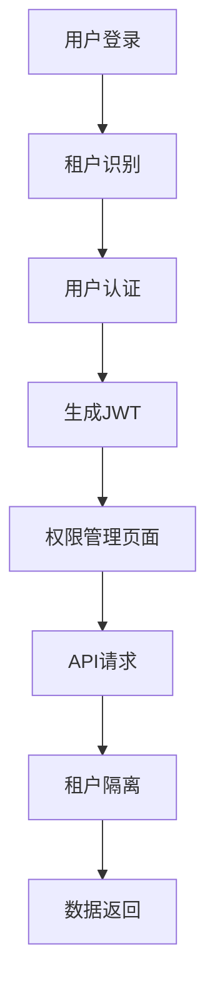

# 多租户权限管理系统重构技术架构文档

## 1. 产品概述

本文档描述了将现有权限管理系统重构为多租户架构的技术方案。核心目标是实现租户级别的数据隔离和权限管理，同时保持前端用户体验的无感知升级。

重构后的系统将支持多个租户共享同一套应用实例，每个租户的数据完全隔离，权限管理独立，为SaaS化部署奠定基础。

## 2. 核心功能

### 2.1 用户角色

| 角色 | 注册方式 | 核心权限 |
|------|----------|----------|
| 租户管理员 | 系统分配租户ID | 管理租户内所有用户和权限配置 |
| 普通用户 | 租户管理员邀请 | 访问租户内被授权的功能模块 |
| 系统管理员 | 超级管理员创建 | 管理所有租户和系统级配置 |

### 2.2 功能模块

我们的多租户权限管理系统包含以下主要页面：
1. **登录页面**：租户识别、用户认证、JWT令牌生成
2. **权限管理页面**：租户级权限配置、用户角色管理、数据访问控制
3. **系统管理页面**：租户管理、系统监控、审计日志查看

### 2.3 页面详情

| 页面名称 | 模块名称 | 功能描述 |
|----------|----------|----------|
| 登录页面 | 租户识别 | 根据用户名自动识别所属租户，返回tenantId |
| 登录页面 | 用户认证 | 验证用户凭证，生成包含租户信息的JWT令牌 |
| 权限管理页面 | 租户权限配置 | 管理当前租户的权限策略和用户角色分配 |
| 权限管理页面 | 数据访问统计 | 显示当前租户的数据访问统计和审计日志 |
| 系统管理页面 | 租户管理 | 创建、编辑、删除租户，配置租户级别设置 |
| 系统管理页面 | 系统监控 | 监控所有租户的系统状态和性能指标 |

## 3. 核心流程

**用户登录流程：**
用户输入用户名和密码 → 系统根据用户名查找所属租户 → 验证用户凭证 → 生成包含tenantId的JWT令牌 → 返回认证信息给前端

**API请求流程：**
前端发起API请求 → 中间件从JWT解析tenantId → 在数据库查询中自动添加租户过滤条件 → 返回租户隔离的数据

**权限验证流程：**
用户访问功能 → 系统验证JWT有效性 → 检查用户在当前租户的权限 → 允许或拒绝访问

## 4. 用户界面设计

### 4.1 设计风格

- **主色调**：#3B82F6（蓝色）、#10B981（绿色）
- **按钮样式**：圆角设计，渐变背景
- **字体**：Inter字体，标题16px，正文14px
- **布局风格**：卡片式布局，顶部导航栏
- **图标风格**：Heroicons线性图标，租户标识使用建筑物图标

### 4.2 页面设计概览

| 页面名称 | 模块名称 | UI元素 |
|----------|----------|--------|
| 登录页面 | 租户识别 | 自动显示租户名称，蓝色#3B82F6背景，居中卡片布局 |
| 权限管理页面 | 租户信息 | 顶部显示当前租户名称，绿色#10B981标识，Inter字体 |
| 系统管理页面 | 租户列表 | 表格布局，每行显示租户状态，圆角按钮操作 |

### 4.3 响应式设计

系统采用桌面优先设计，支持移动端自适应，针对触摸交互进行优化，确保在各种设备上的良好用户体验。