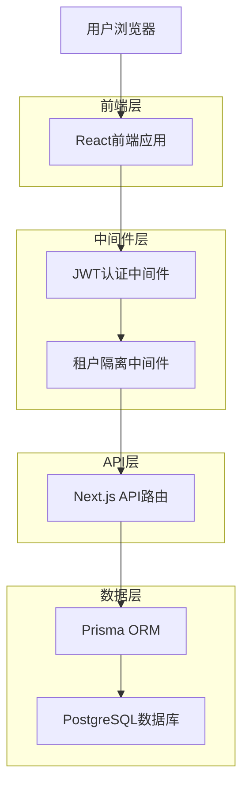
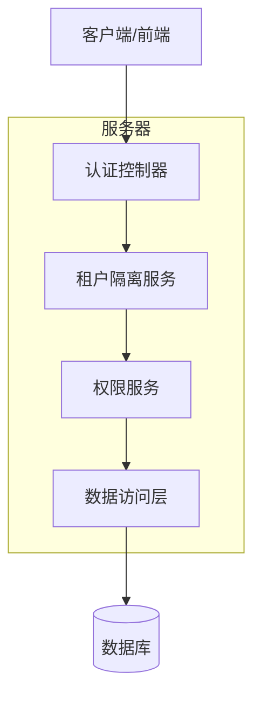
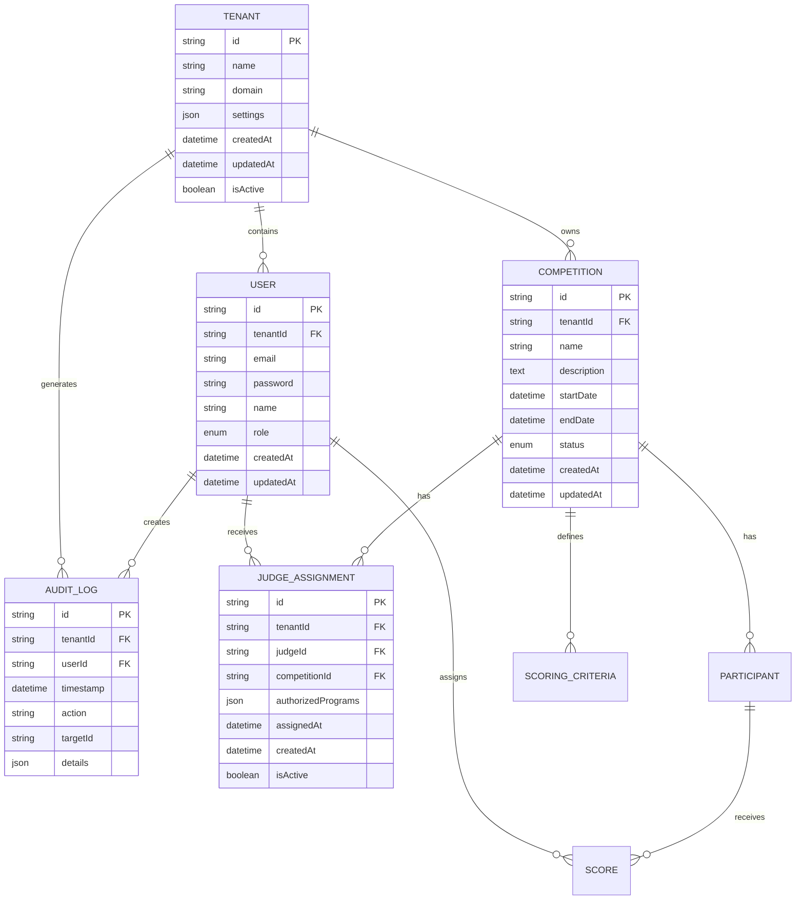

# 多租户系统技术架构设计

## 1. 架构设计



## 2. 技术描述

* **前端**: React\@18 + Next.js\@14 + TypeScript + Tailwind CSS

* **后端**: Next.js API Routes + NextAuth.js

* **数据库**: Supabase (PostgreSQL) + Prisma ORM

* **认证**: NextAuth.js + JWT

* **状态管理**: React Context + localStorage

## 3. 路由定义

| 路由                       | 用途                 |
| ------------------------ | ------------------ |
| /login                   | 登录页面，支持租户识别和用户认证   |
| /dashboard/permissions   | 权限管理页面，显示当前租户的权限配置 |
| /dashboard/tenants       | 租户管理页面，系统管理员专用     |
| /api/auth/\[...nextauth] | NextAuth.js认证端点    |
| /api/tenants             | 租户管理API            |
| /api/permissions/\*      | 权限相关API，支持租户隔离     |

## 4. API定义

### 4.1 核心API

**用户认证相关**

```
POST /api/auth/signin
```

请求:

| 参数名      | 参数类型   | 是否必需 | 描述   |
| -------- | ------ | ---- | ---- |
| email    | string | true | 用户邮箱 |
| password | string | true | 用户密码 |

响应:

| 参数名         | 参数类型   | 描述      |
| ----------- | ------ | ------- |
| user        | object | 用户信息    |
| tenantId    | string | 租户ID    |
| role        | string | 用户角色(admin/organizer/judge) |
| permissions | array  | 用户权限列表 |
| accessToken | string | JWT访问令牌 |

示例:

```json
{
  "user": {
    "id": "user_123",
    "email": "user@example.com",
    "name": "张三",
    "role": "organizer"
  },
  "tenantId": "tenant_456",
  "role": "organizer",
  "permissions": ["competition:create", "competition:manage", "judge:assign"],
  "accessToken": "eyJhbGciOiJIUzI1NiIsInR5cCI6IkpXVCJ9..."
}
```

**租户管理相关**

```
GET /api/tenants
POST /api/tenants
PUT /api/tenants/:id
DELETE /api/tenants/:id
```

**权限管理相关**

```
GET /api/permissions/data-access/stats
GET /api/permissions/data-access/logs
POST /api/permissions/policies
GET /api/permissions/check
POST /api/permissions/assign
```

权限验证接口
```
GET /api/permissions/check
```

请求:
| 参数名 | 参数类型 | 是否必需 | 描述 |
|--------|----------|----------|------|
| resource | string | true | 资源标识 |
| action | string | true | 操作类型 |

响应:
| 参数名 | 参数类型 | 描述 |
|--------|----------|------|
| allowed | boolean | 是否允许访问 |
| reason | string | 拒绝原因(如果适用) |

角色权限分配接口
```
POST /api/permissions/assign
```

请求:
| 参数名 | 参数类型 | 是否必需 | 描述 |
|--------|----------|----------|------|
| userId | string | true | 用户ID |
| role | string | true | 角色类型 |
| resources | array | false | 资源权限列表 |

响应:
| 参数名 | 参数类型 | 描述 |
|--------|----------|------|
| success | boolean | 分配是否成功 |
| permissions | array | 更新后的权限列表 |

## 5. 服务器架构图



## 6. 数据模型

### 6.1 数据模型定义



### 6.2 数据定义语言

**租户表 (tenants)**

```sql
-- 创建租户表
CREATE TABLE tenants (
    id UUID PRIMARY KEY DEFAULT gen_random_uuid(),
    name VARCHAR(255) NOT NULL,
    domain VARCHAR(255) UNIQUE,
    settings JSONB DEFAULT '{}',
    created_at TIMESTAMP WITH TIME ZONE DEFAULT NOW(),
    updated_at TIMESTAMP WITH TIME ZONE DEFAULT NOW(),
    is_active BOOLEAN DEFAULT true
);

-- 创建索引
CREATE INDEX idx_tenants_domain ON tenants(domain);
CREATE INDEX idx_tenants_is_active ON tenants(is_active);

-- 初始化数据
INSERT INTO tenants (name, domain, settings) VALUES 
('默认租户', 'default.example.com', '{"theme": "default"}'),
('演示租户', 'demo.example.com', '{"theme": "demo"}');
```

**用户表修改 (users)**

```sql
-- 添加租户ID字段
ALTER TABLE users ADD COLUMN tenant_id UUID REFERENCES tenants(id);

-- 创建索引
CREATE INDEX idx_users_tenant_id ON users(tenant_id);
CREATE INDEX idx_users_email_tenant ON users(email, tenant_id);

-- 更新现有用户数据
UPDATE users SET tenant_id = (SELECT id FROM tenants WHERE domain = 'default.example.com' LIMIT 1);

-- 添加约束
ALTER TABLE users ALTER COLUMN tenant_id SET NOT NULL;
```

**比赛表修改 (competitions)**

```sql
-- 添加租户ID字段
ALTER TABLE competitions ADD COLUMN tenant_id UUID REFERENCES tenants(id);

-- 创建索引
CREATE INDEX idx_competitions_tenant_id ON competitions(tenant_id);

-- 更新现有数据
UPDATE competitions SET tenant_id = (SELECT id FROM tenants WHERE domain = 'default.example.com' LIMIT 1);

-- 添加约束
ALTER TABLE competitions ALTER COLUMN tenant_id SET NOT NULL;
```

**审计日志表修改 (audit\_logs)**

```sql
-- 添加租户ID字段
ALTER TABLE audit_logs ADD COLUMN tenant_id UUID REFERENCES tenants(id);

-- 创建索引
CREATE INDEX idx_audit_logs_tenant_id ON audit_logs(tenant_id);
CREATE INDEX idx_audit_logs_tenant_timestamp ON audit_logs(tenant_id, timestamp DESC);

-- 更新现有数据
UPDATE audit_logs SET tenant_id = (
    SELECT u.tenant_id FROM users u WHERE u.id = audit_logs.user_id LIMIT 1
);

-- 添加约束
ALTER TABLE audit_logs ALTER COLUMN tenant_id SET NOT NULL;

-- 创建评委分配表
CREATE TABLE judge_assignments (
    id UUID PRIMARY KEY DEFAULT gen_random_uuid(),
    tenant_id UUID NOT NULL REFERENCES tenants(id),
    judge_id UUID NOT NULL REFERENCES users(id),
    competition_id UUID NOT NULL REFERENCES competitions(id),
    authorized_programs JSONB DEFAULT '[]',
    assigned_at TIMESTAMP WITH TIME ZONE DEFAULT NOW(),
    created_at TIMESTAMP WITH TIME ZONE DEFAULT NOW(),
    is_active BOOLEAN DEFAULT true
);

-- 创建索引
CREATE INDEX idx_judge_assignments_tenant_id ON judge_assignments(tenant_id);
CREATE INDEX idx_judge_assignments_judge_id ON judge_assignments(judge_id);
CREATE INDEX idx_judge_assignments_competition_id ON judge_assignments(competition_id);
CREATE INDEX idx_judge_assignments_active ON judge_assignments(is_active);

-- 添加唯一约束
CREATE UNIQUE INDEX idx_judge_assignments_unique ON judge_assignments(judge_id, competition_id) WHERE is_active = true;
```

**Supabase权限配置**

```sql
-- 为anon角色授予基本读取权限
GRANT SELECT ON tenants TO anon;
GRANT SELECT ON users TO anon;

-- 为authenticated角色授予完整权限
GRANT ALL PRIVILEGES ON tenants TO authenticated;
GRANT ALL PRIVILEGES ON users TO authenticated;
GRANT ALL PRIVILEGES ON competitions TO authenticated;
GRANT ALL PRIVILEGES ON audit_logs TO authenticated;
GRANT ALL PRIVILEGES ON judge_assignments TO authenticated;

-- 行级安全策略
ALTER TABLE users ENABLE ROW LEVEL SECURITY;
ALTER TABLE competitions ENABLE ROW LEVEL SECURITY;
ALTER TABLE audit_logs ENABLE ROW LEVEL SECURITY;
ALTER TABLE judge_assignments ENABLE ROW LEVEL SECURITY;

-- 用户只能访问自己租户的数据
CREATE POLICY "Users can only access their tenant data" ON users
    FOR ALL USING (tenant_id = current_setting('app.current_tenant_id')::UUID);

CREATE POLICY "Competitions tenant isolation" ON competitions
    FOR ALL USING (tenant_id = current_setting('app.current_tenant_id')::UUID);

CREATE POLICY "Audit logs tenant isolation" ON audit_logs
    FOR ALL USING (tenant_id = current_setting('app.current_tenant_id')::UUID);

CREATE POLICY "Judge assignments tenant isolation" ON judge_assignments
    FOR ALL USING (tenant_id = current_setting('app.current_tenant_id')::UUID);

-- 角色权限策略
CREATE POLICY "Organizers can manage their competitions" ON competitions
    FOR ALL USING (
        tenant_id = current_setting('app.current_tenant_id')::UUID AND
        (current_setting('app.current_user_role') = 'admin' OR 
         creator_id = current_setting('app.current_user_id')::UUID)
    );

CREATE POLICY "Judges can only view assigned competitions" ON judge_assignments
    FOR SELECT USING (
        tenant_id = current_setting('app.current_tenant_id')::UUID AND
        (current_setting('app.current_user_role') = 'admin' OR 
         judge_id = current_setting('app.current_user_id')::UUID)
    );
```

