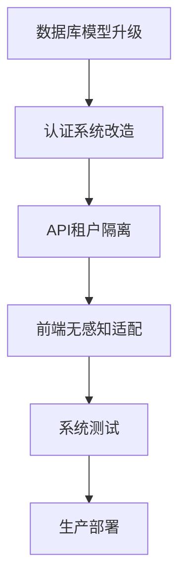

# 多租户重构实施方案

## 1. 实施概述

本文档详细描述多租户权限管理系统的具体实施步骤，包括数据库改造、认证系统重构、API中间件开发和前端适配等关键环节。

实施将分为四个阶段：数据库模型升级、认证系统改造、API租户隔离和前端无感知适配，确保系统平滑过渡到多租户架构。

## 2. 核心功能

### 2.1 实施阶段

| 阶段    | 实施方式        | 核心目标        |
| ----- | ----------- | ----------- |
| 数据库改造 | 添加租户表和关联字段  | 建立租户数据隔离基础  |
| 认证重构  | 修改JWT包含租户信息 | 实现租户级别的身份认证 |
| API隔离 | 开发租户隔离中间件   | 确保数据访问的租户隔离 |
| 前端适配  | 会话管理增加租户信息  | 保持用户体验无感知升级 |

### 2.2 实施模块

我们的多租户重构包含以下主要实施内容：

1. **数据库模型升级**：租户表创建、外键关联、数据迁移
2. **认证系统改造**：JWT令牌增强、登录流程重构、会话管理升级
3. **API中间件开发**：租户识别、数据过滤、权限验证
4. **前端无感知适配**：会话存储、API调用、状态管理

### 2.3 实施详情

| 实施阶段  | 模块名称  | 实施描述                                            |
| ----- | ----- | ----------------------------------------------- |
| 数据库改造 | 租户表创建 | 创建tenants表，定义租户基本信息和配置                          |
| 数据库改造 | 外键关联  | 为users、competitions、audit\_logs等表添加tenant\_id字段 |
| 数据库改造 | 数据迁移  | 将现有数据关联到默认租户，确保数据完整性                            |
| 认证重构  | JWT增强 | 在JWT payload中添加tenantId字段                       |
| 认证重构  | 登录流程  | 根据用户名查找租户，返回租户信息                                |
| API隔离 | 中间件开发 | 创建租户隔离中间件，自动添加租户过滤条件                            |
| API隔离 | 权限验证  | 验证用户在当前租户的操作权限                                  |
| 前端适配  | 会话管理  | 在localStorage中存储tenantId信息                      |
| 前端适配  | API调用 | 确保所有API请求携带正确的认证信息                              |

## 3. 实施流程

**阶段一：数据库模型升级**
创建租户表 → 添加租户关联字段 → 数据迁移脚本 → 索引优化 → 行级安全策略

**阶段二：认证系统改造**
修改NextAuth配置 → 增强JWT payload → 重构登录逻辑 → 租户识别机制 → 会话管理升级

**阶段三：API租户隔离**
开发中间件 → API路由改造 → 数据查询过滤 → 权限验证逻辑 → 错误处理机制

**阶段四：前端无感知适配**
会话存储升级 → API调用适配 → 状态管理改造 → 用户界面调整 → 测试验证



## 4. 技术实施细节

### 4.1 数据库改造实施

**步骤1：创建租户表**

```sql
-- 创建租户表
CREATE TABLE tenants (
    id UUID PRIMARY KEY DEFAULT gen_random_uuid(),
    name VARCHAR(255) NOT NULL,
    domain VARCHAR(255) UNIQUE,
    settings JSONB DEFAULT '{}',
    created_at TIMESTAMP WITH TIME ZONE DEFAULT NOW(),
    updated_at TIMESTAMP WITH TIME ZONE DEFAULT NOW(),
    is_active BOOLEAN DEFAULT true
);
```

**步骤2：添加租户关联**

```sql
-- 为现有表添加租户ID
ALTER TABLE users ADD COLUMN tenant_id UUID REFERENCES tenants(id);
ALTER TABLE competitions ADD COLUMN tenant_id UUID REFERENCES tenants(id);
ALTER TABLE audit_logs ADD COLUMN tenant_id UUID REFERENCES tenants(id);
```

**步骤3：数据迁移**

```sql
-- 创建默认租户
INSERT INTO tenants (name, domain) VALUES ('默认租户', 'default.local');

-- 将现有数据关联到默认租户
UPDATE users SET tenant_id = (SELECT id FROM tenants WHERE domain = 'default.local');
UPDATE competitions SET tenant_id = (SELECT id FROM tenants WHERE domain = 'default.local');
```

### 4.2 认证系统重构

**NextAuth配置修改**

```typescript
// src/lib/auth.ts
import { NextAuthOptions } from 'next-auth'
import CredentialsProvider from 'next-auth/providers/credentials'
import { prisma } from '@/lib/prisma'
import bcrypt from 'bcryptjs'

export const authOptions: NextAuthOptions = {
  providers: [
    CredentialsProvider({
      name: 'credentials',
      credentials: {
        email: { label: 'Email', type: 'email' },
        password: { label: 'Password', type: 'password' }
      },
      async authorize(credentials) {
        if (!credentials?.email || !credentials?.password) {
          return null
        }

        // 查找用户及其租户信息
        const user = await prisma.user.findUnique({
          where: { email: credentials.email },
          include: { tenant: true }
        })

        if (!user || !user.tenant?.isActive) {
          return null
        }

        const isPasswordValid = await bcrypt.compare(
          credentials.password,
          user.password
        )

        if (!isPasswordValid) {
          return null
        }

        return {
          id: user.id,
          email: user.email,
          name: user.name,
          role: user.role,
          tenantId: user.tenantId,
          tenantName: user.tenant.name
        }
      }
    })
  ],
  callbacks: {
    async jwt({ token, user }) {
      if (user) {
        token.role = user.role
        token.tenantId = user.tenantId
        token.tenantName = user.tenantName
      }
      return token
    },
    async session({ session, token }) {
      if (token) {
        session.user.id = token.sub
        session.user.role = token.role
        session.user.tenantId = token.tenantId
        session.user.tenantName = token.tenantName
      }
      return session
    }
  }
}
```

### 4.3 租户隔离中间件

**中间件实现**

```typescript
// src/middleware/tenant-isolation.ts
import { NextRequest, NextResponse } from 'next/server'
import { getToken } from 'next-auth/jwt'

export async function tenantIsolationMiddleware(request: NextRequest) {
  // 获取JWT令牌
  const token = await getToken({ req: request })
  
  if (!token?.tenantId) {
    return NextResponse.json(
      { error: '租户信息缺失' },
      { status: 401 }
    )
  }

  // 在请求头中添加租户ID
  const requestHeaders = new Headers(request.headers)
  requestHeaders.set('x-tenant-id', token.tenantId as string)

  return NextResponse.next({
    request: {
      headers: requestHeaders
    }
  })
}
```

**API路由改造示例**

```typescript
// src/app/api/permissions/data-access/stats/route.ts
import { NextRequest, NextResponse } from 'next/server'
import { prisma } from '@/lib/prisma'
import { getToken } from 'next-auth/jwt'

export async function GET(request: NextRequest) {
  try {
    const token = await getToken({ req: request })
    const tenantId = token?.tenantId as string

    if (!tenantId) {
      return NextResponse.json(
        { error: '租户信息缺失' },
        { status: 401 }
      )
    }

    // 查询当前租户的数据
    const totalAuditLogs = await prisma.auditLog.count({
      where: {
        tenantId: tenantId,
        timestamp: {
          gte: new Date(Date.now() - 30 * 24 * 60 * 60 * 1000)
        }
      }
    })

    const activeUsers = await prisma.user.count({
      where: {
        tenantId: tenantId
      }
    })

    return NextResponse.json({
      totalAuditLogs,
      activeUsers,
      tenantId
    })
  } catch (error) {
    return NextResponse.json(
      { error: '获取统计数据失败' },
      { status: 500 }
    )
  }
}
```

### 4.4 前端适配实施

**会话管理升级**

```typescript
// src/hooks/useAuth.ts
import { useSession } from 'next-auth/react'
import { useEffect } from 'react'

export function useAuth() {
  const { data: session, status } = useSession()

  useEffect(() => {
    if (session?.user?.tenantId) {
      // 将租户信息存储到localStorage
      localStorage.setItem('tenantId', session.user.tenantId)
      localStorage.setItem('tenantName', session.user.tenantName || '')
    }
  }, [session])

  return {
    user: session?.user,
    tenantId: session?.user?.tenantId,
    tenantName: session?.user?.tenantName,
    isLoading: status === 'loading',
    isAuthenticated: !!session
  }
}
```

**API调用适配**

```typescript
// src/lib/api-client.ts
import { getSession } from 'next-auth/react'

class ApiClient {
  private async getHeaders() {
    const session = await getSession()
    return {
      'Content-Type': 'application/json',
      'Authorization': `Bearer ${session?.accessToken}`,
      'X-Tenant-ID': session?.user?.tenantId || ''
    }
  }

  async get(url: string) {
    const headers = await this.getHeaders()
    const response = await fetch(url, { headers })
    return response.json()
  }

  async post(url: string, data: any) {
    const headers = await this.getHeaders()
    const response = await fetch(url, {
      method: 'POST',
      headers,
      body: JSON.stringify(data)
    })
    return response.json()
  }
}

export const apiClient = new ApiClient()
```

## 5. 测试验证方案

### 5.1 单元测试

* 租户隔离中间件测试

* JWT令牌生成和解析测试

* 数据库查询过滤测试

### 5.2 集成测试

* 多租户登录流程测试

* API租户隔离验证

* 前端会话管理测试

### 5.3 性能测试

* 多租户并发访问测试

* 数据库查询性能测试

* 内存使用情况监控

## 6. 部署和监控

### 6.1 部署策略

* 灰度发布，逐步迁移现有租户

* 数据库迁移脚本自动化执行

* 回滚方案准备

### 6.2 监控指标

* 租户隔离有效性监控

* API响应时间监控

* 数据库连接池使用情况

* 错误率和异常监控

