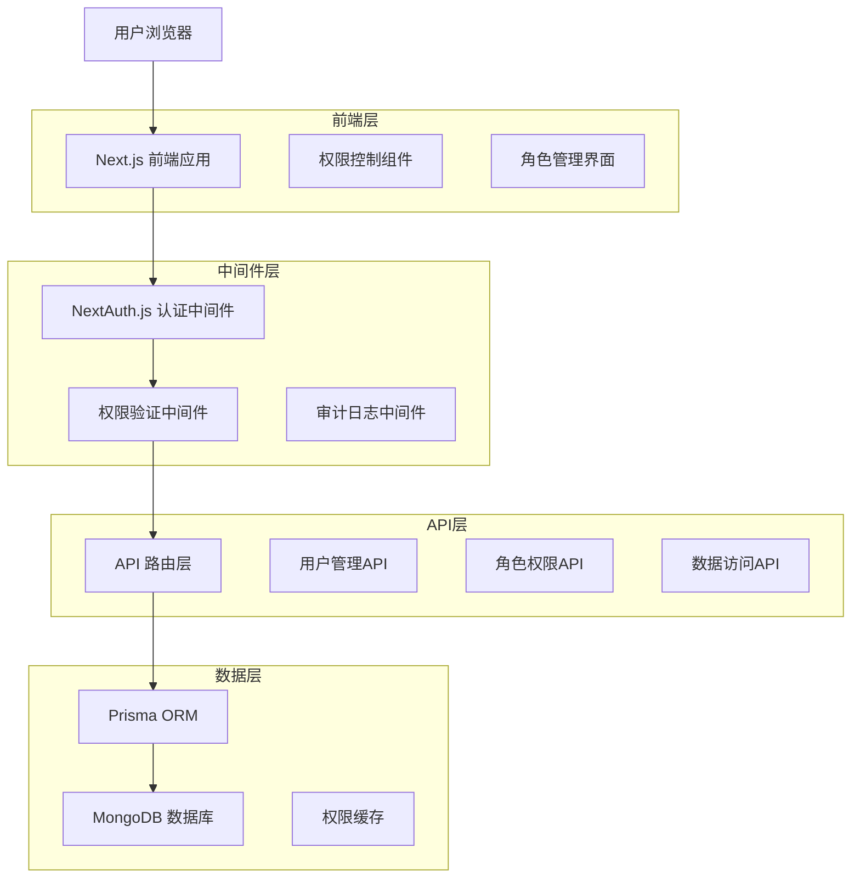
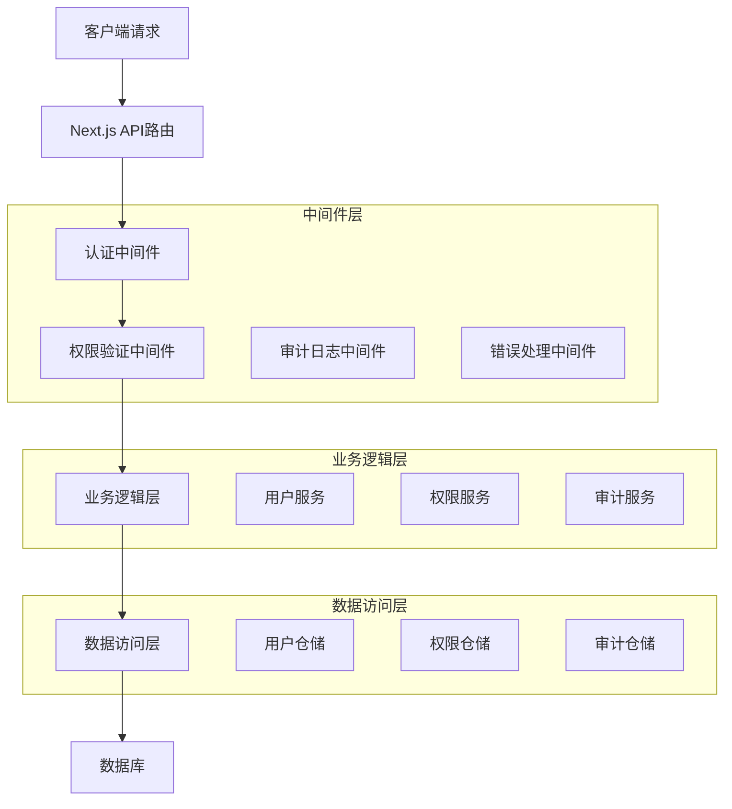
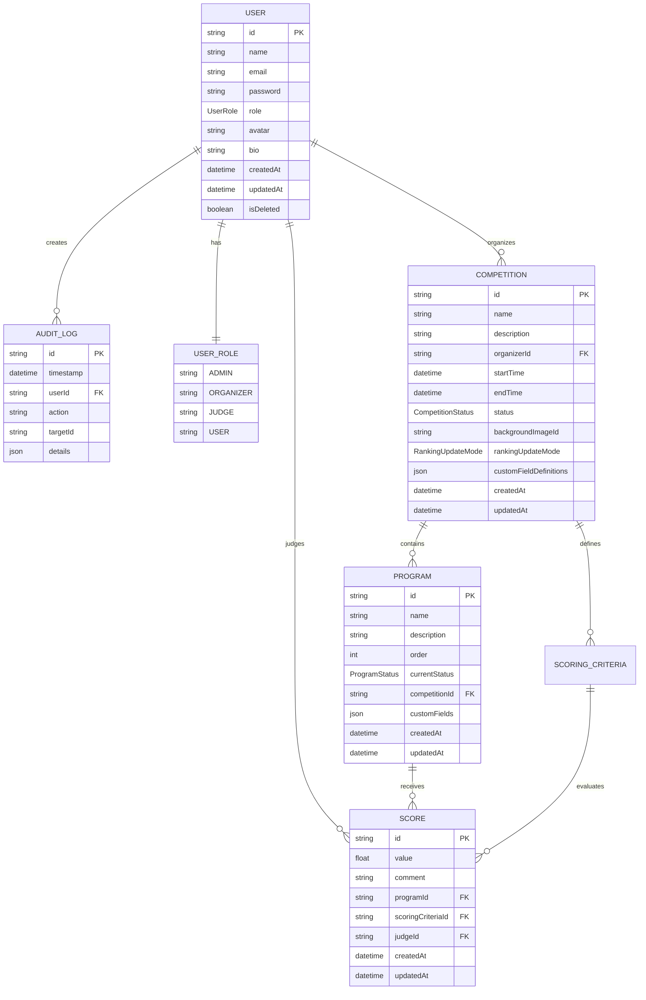

# 权限管理系统技术架构文档

## 1. 架构设计



## 2. 技术描述

- 前端：React@18 + Next.js@15 + TypeScript + Tailwind CSS
- 认证：NextAuth.js + JWT
- 数据库：MongoDB + Prisma ORM
- 缓存：Redis（可选，用于权限缓存）

## 3. 数据服务

- MongoDB：存储用户数据、角色权限、审计日志
- Prisma：提供类型安全的数据库访问
- NextAuth.js：处理用户认证和会话管理

## 4. API定义

### 4.1 核心API

#### 用户角色管理
```
GET /api/users/roles
```

请求：
| 参数名称 | 参数类型 | 是否必需 | 描述 |
|----------|----------|----------|------|
| userId | string | false | 用户ID，不传则获取当前用户角色 |

响应：
| 参数名称 | 参数类型 | 描述 |
|----------|----------|------|
| role | UserRole | 用户角色 |
| permissions | string[] | 权限列表 |
| dataScope | object | 数据访问范围 |

示例：
```json
{
  "role": "ORGANIZER",
  "permissions": ["competition:create", "competition:manage", "judge:assign"],
  "dataScope": {
    "competitions": ["comp_id_1", "comp_id_2"],
    "programs": ["prog_id_1", "prog_id_2"]
  }
}
```

#### 权限验证
```
POST /api/auth/verify-permission
```

请求：
| 参数名称 | 参数类型 | 是否必需 | 描述 |
|----------|----------|----------|------|
| action | string | true | 操作类型 |
| resource | string | true | 资源类型 |
| resourceId | string | false | 资源ID |

响应：
| 参数名称 | 参数类型 | 描述 |
|----------|----------|------|
| allowed | boolean | 是否允许访问 |
| reason | string | 拒绝原因（如果不允许） |

#### 审计日志
```
GET /api/audit-logs
```

请求：
| 参数名称 | 参数类型 | 是否必需 | 描述 |
|----------|----------|----------|------|
| page | number | false | 页码，默认1 |
| limit | number | false | 每页数量，默认20 |
| userId | string | false | 用户ID筛选 |
| action | string | false | 操作类型筛选 |
| startDate | string | false | 开始时间 |
| endDate | string | false | 结束时间 |

响应：
| 参数名称 | 参数类型 | 描述 |
|----------|----------|------|
| logs | AuditLog[] | 审计日志列表 |
| total | number | 总数量 |
| page | number | 当前页码 |
| totalPages | number | 总页数 |

## 5. 服务器架构图



## 6. 数据模型

### 6.1 数据模型定义



### 6.2 数据定义语言

#### 用户表扩展（权限相关字段）
```sql
-- 用户表已存在，权限通过role字段控制
-- 角色枚举：ADMIN, ORGANIZER, JUDGE, USER

-- 创建索引优化权限查询
CREATE INDEX idx_user_role ON users(role);
CREATE INDEX idx_user_email ON users(email);
CREATE INDEX idx_user_created_at ON users(createdAt DESC);
```

#### 审计日志表
```sql
-- 审计日志表已存在
CREATE INDEX idx_audit_log_user_id ON audit_logs(userId);
CREATE INDEX idx_audit_log_action ON audit_logs(action);
CREATE INDEX idx_audit_log_timestamp ON audit_logs(timestamp DESC);
CREATE INDEX idx_audit_log_target_id ON audit_logs(targetId);

-- 初始化权限相关审计日志类型
INSERT INTO audit_logs (userId, action, details) VALUES
('system', 'PERMISSION_SYSTEM_INIT', '{"message": "权限管理系统初始化完成"}');
```

#### 比赛表权限控制
```sql
-- 比赛表已存在，通过organizerId字段控制数据访问范围
CREATE INDEX idx_competition_organizer_id ON competitions(organizerId);
CREATE INDEX idx_competition_status ON competitions(status);
```

#### 评分表权限控制
```sql
-- 评分表已存在，通过judgeId字段控制评委访问范围
CREATE INDEX idx_score_judge_id ON scores(judgeId);
CREATE INDEX idx_score_program_id ON scores(programId);
```

#### 权限验证函数（伪代码）
```typescript
// 权限验证辅助函数
function hasPermission(user: User, action: string, resource: any): boolean {
  switch (user.role) {
    case 'ADMIN':
      return true; // 管理员拥有所有权限
    
    case 'ORGANIZER':
      if (action.startsWith('competition:')) {
        return resource.organizerId === user.id;
      }
      if (action.startsWith('program:') || action.startsWith('participant:')) {
        return resource.competition.organizerId === user.id;
      }
      return false;
    
    case 'JUDGE':
      if (action === 'score:create' || action === 'score:update') {
        return resource.judgeId === user.id;
      }
      if (action === 'program:view') {
        return resource.scores.some(score => score.judgeId === user.id);
      }
      return false;
    
    case 'USER':
      return action.startsWith('view:') && resource.isPublic;
    
    default:
      return false;
  }
}
```