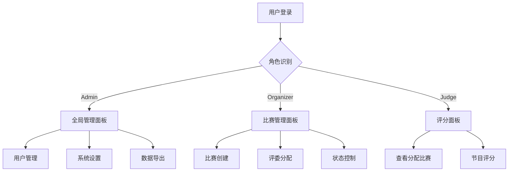

# 权限管理系统角色权限架构文档

## 1. 产品概述

本文档定义了权限管理系统的三级用户角色体系，实现基于角色的访问控制（RBAC）和数据隔离机制。系统支持Admin超级管理员、Organizer比赛组织者和Judge评委三种角色，每种角色具有不同的权限范围和数据访问边界。

通过精细化的权限控制，确保用户只能访问其职责范围内的功能和数据，提升系统安全性和数据隔离效果。

## 2. 核心功能

### 2.1 用户角色

| 角色        | 权限级别  | 核心权限                       |
| --------- | ----- | -------------------------- |
| Admin     | 超级管理员 | 访问所有租户数据，用户管理，系统设置，数据导出    |
| Organizer | 比赛组织者 | 管理自己创建的比赛，评委分配，比赛状态控制，数据导出 |
| Judge     | 评委    | 对被分配比赛进行评分，查看授权节目评分面板      |

### 2.2 功能模块

我们的权限管理系统包含以下主要功能模块：

1. **用户管理模块**：用户创建、角色分配、权限配置
2. **比赛管理模块**：比赛创建、状态控制、评委分配
3. **评分管理模块**：评分权限控制、评分面板访问
4. **数据管理模块**：数据导出、审计日志、系统监控
5. **系统设置模块**：租户配置、安全策略、系统参数

### 2.3 权限详情

| 角色        | 功能模块 | 权限描述                     |
| --------- | ---- | ------------------------ |
| Admin     | 用户管理 | 创建、编辑、删除所有租户的用户账户，分配角色权限 |
| Admin     | 系统设置 | 配置系统参数、安全策略、租户设置、功能开关    |
| Admin     | 数据管理 | 导出所有租户数据、查看全局审计日志、系统监控   |
| Organizer | 比赛管理 | 创建、编辑自己的比赛，管理选手和节目信息     |
| Organizer | 评委分配 | 为自己的比赛分配评委，设置评委权限范围      |
| Organizer | 比赛控制 | 控制比赛状态（开始、暂停、结束），管理比赛流程  |
| Organizer | 数据导出 | 导出自己比赛的相关数据（选手、节目、评分）    |
| Judge     | 评分权限 | 对被分配的比赛进行评分，提交评分结果       |
| Judge     | 评分面板 | 仅能查看被授权节目的评分界面和相关信息      |

## 3. 核心流程

**Admin管理流程：**
系统登录 → 选择租户 → 用户管理/系统设置 → 数据导出/监控 → 审计日志查看

**Organizer工作流程：**
系统登录 → 比赛创建/编辑 → 选手节目管理 → 评委分配 → 比赛状态控制 → 数据导出

**Judge评分流程：**
系统登录 → 查看分配的比赛 → 进入评分面板 → 对授权节目评分 → 提交评分结果



## 4. 数据访问边界

### 4.1 Admin数据访问范围

* **用户数据**：所有租户的用户信息、角色分配、权限配置

* **比赛数据**：所有租户的比赛信息、选手数据、节目信息

* **评分数据**：所有比赛的评分结果、统计数据、排名信息

* **系统数据**：审计日志、系统监控、性能指标、安全事件

* **配置数据**：租户设置、系统参数、功能配置、安全策略

### 4.2 Organizer数据访问范围

* **比赛数据**：仅限自己创建的比赛信息和相关设置

* **选手数据**：自己比赛的参赛选手信息和报名数据

* **节目数据**：自己比赛的节目信息、时间安排、状态控制

* **评委数据**：自己比赛的评委分配、权限设置、评分统计

* **导出数据**：自己比赛的完整数据包（选手、节目、评分、统计）

### 4.3 Judge数据访问范围

* **比赛信息**：仅限被分配的比赛基本信息（名称、时间、规则）

* **节目信息**：仅限被授权评分的节目详细信息

* **评分界面**：仅能访问被授权节目的评分面板和评分标准

* **评分历史**：仅能查看自己提交的评分记录和统计

* **禁止访问**：其他评委评分、选手个人信息、比赛管理功能

## 5. 权限控制机制

### 5.1 角色验证

```typescript
// 角色权限验证示例
interface UserRole {
  role: 'admin' | 'organizer' | 'judge'
  tenantId: string
  permissions: string[]
}

function checkPermission(user: UserRole, resource: string, action: string): boolean {
  // Admin拥有所有权限
  if (user.role === 'admin') {
    return true
  }
  
  // Organizer权限检查
  if (user.role === 'organizer') {
    return checkOrganizerPermission(user, resource, action)
  }
  
  // Judge权限检查
  if (user.role === 'judge') {
    return checkJudgePermission(user, resource, action)
  }
  
  return false
}
```

### 5.2 数据过滤策略

**Organizer数据过滤：**

* 比赛查询：WHERE creator\_id = user.id

* 选手查询：WHERE competition\_id IN (user\_competitions)

* 评分查询：WHERE competition\_id IN (user\_competitions)

**Judge数据过滤：**

* 比赛查询：WHERE id IN (assigned\_competitions)

* 节目查询：WHERE id IN (authorized\_programs)

* 评分查询：WHERE judge\_id = user.id

### 5.3 API权限控制

| API端点                     | Admin | Organizer | Judge  |
| ------------------------- | ----- | --------- | ------ |
| GET /api/users            | ✅ 全部  | ❌ 禁止      | ❌ 禁止   |
| POST /api/competitions    | ✅ 全部  | ✅ 创建      | ❌ 禁止   |
| PUT /api/competitions/:id | ✅ 全部  | ✅ 自己的     | ❌ 禁止   |
| GET /api/scores           | ✅ 全部  | ✅ 自己比赛    | ✅ 自己评分 |
| POST /api/scores          | ❌ 禁止  | ❌ 禁止      | ✅ 授权节目 |
| GET /api/export/data      | ✅ 全部  | ✅ 自己比赛    | ❌ 禁止   |

## 6. 安全策略

### 6.1 身份验证

* **多因素认证**：Admin角色强制启用2FA

* **会话管理**：不同角色设置不同的会话超时时间

* **IP限制**：Admin可配置IP白名单访问

### 6.2 权限审计

* **操作日志**：记录所有用户的关键操作和数据访问

* **权限变更**：记录角色分配和权限修改的完整历史

* **异常监控**：检测权限越界访问和异常操作行为

### 6.3 数据保护

* **敏感数据脱敏**：Judge角色无法查看选手个人敏感信息

* **数据导出限制**：限制导出频率和数据量

* **访问日志**：记录所有数据访问和下载行为

## 7. 实施建议

### 7.1 渐进式部署

1. **第一阶段**：实现基础角色区分和权限验证
2. **第二阶段**：完善数据过滤和API权限控制
3. **第三阶段**：增强安全策略和审计功能

### 7.2 用户培训

* **Admin培训**：系统管理、安全配置、数据分析

* **Organizer培训**：比赛管理、评委分配、数据导出

* **Judge培训**：评分流程、系统操作、注意事项

### 7.3 监控指标

* **权限使用统计**：各角色功能使用频率和模式

* **安全事件监控**：权限越界、异常访问、失败登录

* **性能影响评估**：权限检查对系统性能的影响

