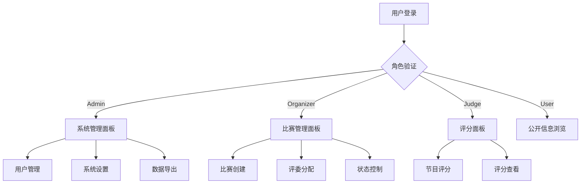

# 权限管理系统产品需求文档

## 1. 产品概述

权限管理系统是比赛评审管理平台的核心安全模块，通过角色基础访问控制(RBAC)确保不同用户只能访问其授权范围内的数据和功能。
系统支持多租户架构下的细粒度权限控制，保障比赛数据安全性和用户操作的合规性。

## 2. 核心功能

### 2.1 用户角色

| 角色 | 注册方法 | 核心权限 |
|------|----------|----------|
| Admin | 系统预设或超级管理员创建 | 全系统管理权限，包括用户管理、系统设置、数据导出 |
| Organizer | 邮箱注册或管理员邀请 | 管理自己创建的比赛，包括评委分配、比赛状态控制、数据导出 |
| Judge | 组织者邀请分配 | 对被分配比赛的评分权限，查看授权节目评分面板 |
| User | 邮箱注册 | 基础浏览权限，查看公开比赛信息 |

### 2.2 功能模块

权限管理系统包含以下核心页面：
1. **角色管理页面**：角色定义、权限配置、角色分配功能模块
2. **用户权限页面**：用户角色查看、权限审计、访问控制模块
3. **数据访问控制页面**：资源权限设置、数据范围限制、访问日志模块
4. **系统设置页面**：权限策略配置、安全参数设置、审计配置模块

### 2.3 页面详情

| 页面名称 | 模块名称 | 功能描述 |
|----------|----------|----------|
| 角色管理页面 | 角色定义 | 创建、编辑、删除用户角色，设置角色基础权限 |
| 角色管理页面 | 权限配置 | 为角色分配具体功能权限，设置数据访问范围 |
| 角色管理页面 | 角色分配 | 为用户分配角色，批量角色操作 |
| 用户权限页面 | 用户角色查看 | 查看用户当前角色和权限详情 |
| 用户权限页面 | 权限审计 | 记录用户权限变更历史，权限使用统计 |
| 用户权限页面 | 访问控制 | 实时权限验证，访问拦截和日志记录 |
| 数据访问控制页面 | 资源权限设置 | 设置比赛、节目、评分等资源的访问权限 |
| 数据访问控制页面 | 数据范围限制 | 基于角色的数据可见性控制 |
| 数据访问控制页面 | 访问日志 | 记录所有数据访问操作，生成访问报告 |
| 系统设置页面 | 权限策略配置 | 配置全局权限策略，设置安全规则 |
| 系统设置页面 | 安全参数设置 | 设置会话超时、密码策略等安全参数 |
| 系统设置页面 | 审计配置 | 配置审计日志级别，设置日志保留策略 |

## 3. 核心流程

### Admin管理流程
管理员登录后可访问所有系统功能，包括用户管理、角色分配、系统配置等。管理员可以创建组织者账户，设置全局权限策略，导出所有数据。

### Organizer操作流程
组织者登录后可创建和管理自己的比赛，邀请评委参与评分，控制比赛状态，导出比赛相关数据。组织者只能访问自己创建的比赛数据。

### Judge评分流程
评委通过组织者邀请获得评分权限，登录后只能看到被分配的比赛和节目，在授权的评分面板中进行打分操作。

## 4. 用户界面设计

### 4.1 设计风格

- 主色调：#3B82F6（蓝色）、#10B981（绿色）
- 按钮样式：圆角现代风格，支持悬停效果
- 字体：系统默认字体，标题16px，正文14px
- 布局风格：卡片式布局，顶部导航栏
- 图标风格：线性图标，统一的视觉语言

### 4.2 页面设计概览

| 页面名称 | 模块名称 | UI元素 |
|----------|----------|--------|
| 角色管理页面 | 角色定义 | 表格布局，操作按钮，模态对话框，颜色编码角色标识 |
| 用户权限页面 | 权限审计 | 时间轴组件，筛选器，分页控件，权限变更高亮显示 |
| 数据访问控制页面 | 资源权限设置 | 树形结构，权限矩阵，拖拽操作，实时权限预览 |
| 系统设置页面 | 安全参数设置 | 表单组件，开关控件，滑块组件，配置验证提示 |

### 4.3 响应式设计

系统采用桌面优先的响应式设计，支持移动端适配。在移动设备上优化触控交互，简化复杂操作流程，确保权限管理功能在各种设备上的可用性。